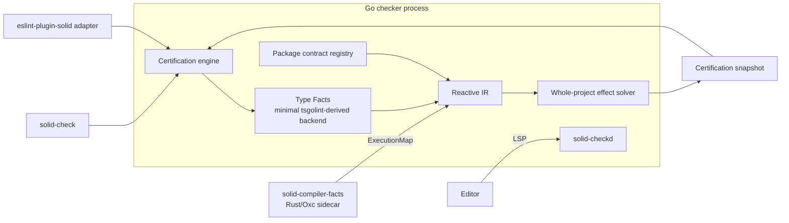

# Solid 2 Reactivity Checker Plan

> This is the canonical plan maintained with the `solid-check` implementation.
> See [implementation-status.md](implementation-status.md) for delivered scope,
> verification evidence, remaining work, and current effort estimates.

- **Status:** Final architectural plan
- **Scope:** Solid 2 only
- **Primary objective:** Build a project-level checker that can certify supported Solid 2 programs against Solid's reactive execution rules, with the same analysis available through a CLI, a focused LSP, and an ESLint compatibility adapter.

## Executive summary

Build one deep **certification engine** and expose it through several thin adapters:

- `solid-check`: the CLI and CI interface.
- `solid-checkd`: a focused Solid LSP server.
- `eslint-plugin-solid`: a compatibility adapter for existing lint workflows.
- `solid-compiler-facts`: a Rust sidecar derived from the Oxc Solid compiler that reports how JSX and compiler-managed callbacks execute.
- `solid-reactivity.json`: generated package contracts that preserve reactive semantics across package boundaries.

Bootstrap the native TypeScript integration from **tsgolint**, then extract and retain only the pieces required to access typescript-go's AST, checker, projects, and module resolution. Do **not** fork the tsgo LSP. The editor's normal TypeScript server remains responsible for ordinary TypeScript features; `solid-checkd` supplies Solid-specific diagnostics, explanations, and fixes.

TypeScript 7.1's future programmatic API is an optional replacement for the extracted tsgolint shims. It must not block initial development or leak into the certification engine's interface.

## Product guarantee

The checker distinguishes three outcomes:

```ts
type CertificationStatus = "certified" | "violation" | "uncertifiable";
```

- **Certified:** every applicable proof obligation in the supported scope was satisfied.
- **Violation:** the checker proved that the program breaches a Solid reactive rule.
- **Uncertifiable:** the program crossed an explicitly unsupported boundary, such as reactive behavior flowing through `any`, `eval`, unresolved dynamic dispatch, or a dependency without source or a trusted contract.

Certification mode fails on both `violation` and `uncertifiable`. Unsupported dynamic behavior is considered the user's responsibility, but it must be rejected rather than silently accepted; otherwise it could create false negatives.

The intended accuracy claim is:

> Every program accepted by certification mode satisfies the implemented Solid 2 reactivity model, relative to the trusted Solid compiler facts and package contracts.

This is a soundness target for the declared scope, not a claim that arbitrary JavaScript is decidable or that the implementation itself is formally verified.

## Supported scope

- The current Solid 2 semantics on the `next` branch during beta.
- TypeScript and TSX.
- Statically analysable JavaScript and JSX where useful.
- The forked Oxc Solid compiler configuration supported by the conformance suite.
- Dependencies whose source can be analysed or which provide a valid package contract.
- Statically resolvable imports, re-exports, aliases, calls, overloads, and generic instantiations.
- Signals, stores, props, async reactive values, ownership, cleanup, effects, control flow, directives, and compiler-generated JSX tracking regions.

## Non-goals

- Solid 1.x support.
- Certifying arbitrary dynamic JavaScript.
- Replacing the normal TypeScript language server.
- Forking the tsgo LSP.
- Maintaining all of tsgolint as a product.
- Forking Oxlint or depending on an external Rust plugin mechanism.
- Reimplementing TypeScript's type system in Rust.
- Executing dependency configuration code to discover semantics.
- Moving stylistic or convention-only ESLint rules into the certification engine.
- Supporting old Solid 2 beta semantics after the project has moved forward.

## Architecture



The certification engine is the deep module. The CLI, LSP, and ESLint integrations are adapters at its external seam. They must never implement independent reactive analysis.

## Canonical domain language

| Term | Meaning |
| --- | --- |
| Reactive provenance | Accepted proof that a value or property is reactive and the binding flow by which it reached a read or write |
| Execution region | Original-source code executed as tracked, untracked, owned, event-driven, deferred, cleanup, effect-compute, effect-apply, or another compiler/runtime-defined role |
| Reactive operation | A read, write, call, callback invocation, primitive creation, cleanup registration, async read, or ownership operation represented in the Reactive IR |
| Effect summary | A compact interprocedural description of a function's reactive behavior |
| Proof obligation | A fact that must be established for certification |
| Package contract | A static description of the reactive effects of a package's exported interface |
| Violation | A proven breach of a Solid rule |
| Uncertifiable | An unresolved obligation caused by a deliberately unsupported boundary |
| Certification snapshot | An immutable project result containing status, findings, explanations, fixes, and analysis metrics |

## External engine interface

The CLI, LSP, tests, and ESLint adapter should cross one small project-level interface:

```ts
interface CertificationEngine {
  openProject(config: ProjectConfig): Promise<ProjectSession>;
}

interface ProjectSession {
  update(changes: readonly FileChange[]): Promise<AnalysisDelta>;
  snapshot(scope?: AnalysisScope): Promise<CertificationSnapshot>;
  close(): void;
}

interface CertificationSnapshot {
  status: CertificationStatus;
  findings: readonly Finding[];
  packageSummaries: readonly PackageSummary[];
  metrics: AnalysisMetrics;
}
```

The interface must not expose TypeScript nodes, Oxc nodes, compiler symbols, checker types, internal scope trees, or solver data structures.

## Module 1: minimal typescript-go backend

### Decision

Fork tsgolint as a bootstrap source, pin its typescript-go revision, establish an end-to-end Solid test, then extract only the required integration into a private `typefacts` module.

### Retain from tsgolint

- AST shims.
- Type-checker shims.
- Program/compiler shims.
- `tsconfig` and project loading.
- TypeScript module resolution.
- Source locations and stable internal identities.
- Efficient AST traversal.
- Parallel project/file processing where it benefits the solver.

### Remove

- typescript-eslint rule implementations.
- Oxlint transport, configuration, and formatting.
- ESLint-compatible rule option handling.
- General-purpose lint rule registration.
- Oxlint-specific CLI and npm packaging.
- Unrelated fixtures and benchmarks.

### Internal interface

```ts
interface TypeFacts {
  openProject(configPath: string): ProjectId;
  update(changes: readonly FileChange[]): AffectedSet;

  symbolAt(location: SourceLocation): SymbolId | null;
  resolveAlias(symbol: SymbolId): SymbolId;
  declarations(symbol: SymbolId): readonly DeclarationInfo[];

  typeAt(location: SourceLocation): TypeId;
  resolvedCall(location: SourceLocation): CallInfo;
  references(symbol: SymbolId): readonly SourceLocation[];
  affectedFiles(changes: readonly FileChange[]): readonly FileId[];
}
```

All use of `go:linkname` or other unstable typescript-go integration remains inside this module. No tsgolint terminology escapes it.

### TypeScript 7.1 migration

When the official TypeScript 7.1 programmatic API is available, implement a second `TypeFacts` adapter and compare it against the same conformance and performance suite. Replace the tsgolint-derived backend only if the official API provides sufficiently complete and efficient bulk access to:

- AST nodes and stable identities.
- Symbols, aliases, declarations, and types.
- Resolved call signatures and generic substitutions.
- References and call targets.
- Incremental project updates and affected-file information.
- Project references and module resolution.

Fine-grained IPC queries for every node are not acceptable. The adapter must use bulk or composite operations. TypeScript 7.1 is an optimization and maintenance opportunity, not a project dependency.

## Module 2: Solid compiler facts

### Decision

Fork the Oxc Solid compiler and add an analysis mode. The compiler remains the authority for JSX execution semantics. The checker analyses original source and must never infer compiler behavior from transformed output.

### Required interface

```ts
interface CompilerAnalysisRequest {
  path: string;
  source: string;
  sourceHash: string;
  compilerOptions: SolidCompilerOptions;
}

interface ExecutionMap {
  sourceHash: string;
  trackedRegions: readonly ExecutionRegion[];
  untrackedRegions: readonly ExecutionRegion[];
  ownershipRegions: readonly OwnershipRegion[];
  callbackRoles: readonly CallbackRole[];
  jsxOperations: readonly JsxOperation[];
}
```

The compiler facts must cover:

- Tracked JSX expressions.
- One-time and immediate evaluation.
- Event handlers.
- Deferred callbacks.
- Rendering functions and render callbacks.
- Control-flow callback roles.
- Directive setup and application phases.
- DOM/render effects.
- Component invocation.
- Loading and error boundary regions where statically represented.
- Ownership regions created by compiler-managed constructs.

### Process model

Run `solid-compiler-facts` as a persistent Rust sidecar. The Go checker sends only changed JSX/TSX files and receives compact facts. Associate facts with TypeScript nodes using:

- Normalized source path.
- Source-content hash.
- Original source byte range.
- Syntax kind where necessary.
- A tested UTF-8 byte to UTF-16 offset mapping.

Only technical compatibility identifiers such as `compilerFactsProtocol` are required. There is no routing between old Solid 2 beta semantics.

## Module 3: Reactive IR

The Reactive IR combines TypeScript, compiler, binding, and package facts into a representation independent of either AST implementation.

```ts
type ReactiveOperation =
  | ReactiveRead
  | ReactiveWrite
  | FunctionCall
  | CallbackInvocation
  | PrimitiveCreation
  | CleanupRegistration
  | AsyncRead
  | OwnerCreation
  | OwnerDetachment;
```

The IR records:

- Original source locations.
- Reactive and binding provenance.
- Execution and ownership regions.
- Call and callback edges.
- Read, write, return, and escape paths.
- Async behavior.
- Package contract evidence.
- Unresolved proof obligations.

The IR is internal and may evolve freely. Package contracts and public diagnostics must not serialize the entire IR.

## Module 4: whole-project effect solver

The solver computes effect summaries for relevant functions and exported values:

```ts
interface EffectSummary {
  returnedReactivity: ReturnProvenance;
  reactiveReads: readonly ParameterPath[];
  reactiveWrites: readonly ParameterPath[];
  callbacks: readonly CallbackEffect[];
  ownership: OwnershipEffect;
  asyncBehavior: AsyncEffect;
  uncertainty: readonly UncertifiableCause[];
}
```

It must handle:

- Imports, aliases, namespace imports, re-exports, and subpath exports.
- Generics, overloads, and resolved call signatures.
- Higher-order functions and callback forwarding.
- Returned closures.
- Tuple and object property flows.
- Stores, props, and nested reactive property provenance.
- Recursive call graphs using strongly connected components and fixed-point iteration.
- Conditional call targets.
- Ownership, cleanup, and primitive lifetime.
- Effect compute/apply phases.
- Async reactive values and tracked boundary requirements.
- Dynamic boundaries that make certification fail.

Summaries are cached by function identity, source version, relevant type instantiation, compiler-facts hash, and dependency-summary hashes.

## Module 5: package contracts

Packages publish a non-executable `solid-reactivity.json` file alongside JavaScript and declarations:

```text
package/
├── dist/index.js
├── dist/index.d.ts
└── solid-reactivity.json
```

A contract contains:

- `schemaVersion`.
- Package and export identities.
- Exported effect summaries.
- Declaration and implementation hashes where available.
- The compiler-facts protocol when compiler behavior affects an export.
- Evidence identifying whether a summary was generated, reviewed, or explicitly trusted.

It does not contain Solid beta-version routing. During beta, the checker, Solid runtime, compiler fork, bundled contracts, and tests move forward together.

### Solid Primitives test ecosystem

Fork Solid Primitives and use it to exercise:

- Accessor-producing helpers.
- Higher-order reactive functions.
- Tracked, inline, and deferred callbacks.
- Stores and nested properties.
- Async primitives.
- Generic factories.
- Re-exports and package subpaths.
- Dependencies between contracted packages.

Prefer generated contracts followed by review. Hand-authoring every contract would fail to test the inference and emission pipeline.

## Adapters

### CLI: `solid-check`

```text
solid-check
solid-check --project tsconfig.json
solid-check --watch
solid-check --certify
solid-check --emit-contract
solid-check --format json
solid-check --format sarif
```

The CLI is the first production adapter because it provides deterministic CI behavior and the simplest end-to-end test surface.

### LSP: `solid-checkd`

Build a focused Solid language server around the same project session. It runs alongside the normal TypeScript server and provides:

- Incremental Solid diagnostics.
- Related locations across files.
- Quick fixes and refactorings justified by the proof.
- “Why is this reactive?” explanations.
- “Why is this uncertifiable?” explanations.
- Workspace certification status.
- Optional custom `solid/explainFinding` and `solid/certificationStatus` requests.

The VS Code extension only launches and configures `solid-checkd`. Other LSP-capable editors can use the server directly.

### ESLint compatibility adapter

Keep syntax/style rules in ESLint. Semantic reactivity rules translate a certification snapshot into ESLint reports. The adapter must not contain another reactivity detector or effect solver.

## Solid 2 semantic coverage

The initial correctness catalog is derived from the current Solid 2 RFCs, runtime diagnostics, compiler behavior, and tests. Priority order:

1. Untracked reads of signals, props, and stores.
2. Reactive writes and invalidation inside forbidden owned scopes.
3. Effect compute/apply execution roles.
4. Callback execution roles.
5. Primitive creation in leaf/forbidden owners.
6. Cleanup registration and return rules.
7. Ownerless effects, cleanups, and boundaries.
8. Async reactive reads and tracked boundary requirements.
9. JSX, control-flow, directives, and DOM compiler regions.
10. Package-provided primitives and renderers.

The runtime's structured development diagnostics provide a differential-testing oracle for executed paths. Runtime observation validates the static model but does not replace static proof.

## Incremental and performance design

- Keep one persistent project session per configured TypeScript project.
- Maintain editor overlays and monotonically increasing file versions.
- Parse/type-check through typescript-go once per affected project state.
- Ask the Oxc sidecar to reanalyse only changed JSX/TSX files.
- Cache compiler facts by source hash and compiler options.
- Cache function summaries and invalidate through reverse dependency edges.
- Recompute recursive summary groups as strongly connected components.
- Batch type queries and avoid per-node process round trips.
- Stream immutable diagnostic deltas to the LSP.
- Parallelize independent projects and summary groups where deterministic.
- Profile before moving additional solver work to Rust.

Provisional finished-product scores:

| Quality | Target |
| --- | ---: |
| Accuracy within certified scope | 10/10 |
| Practical ecosystem coverage at first release | 7/10 |
| Performance | 9.5/10 |
| Warm IDE responsiveness | 9/10 |
| Implementation difficulty | 10/10 |
| Maintenance difficulty | 8.5/10 after minimizing the tsgolint derivative |

## Verification strategy

### Semantic conformance

- Map every statically relevant Solid 2 development diagnostic to proof rules.
- Derive fixtures from the Solid 2 RFCs and runtime tests.
- Compare static findings with `DEV.diagnostics.capture()` for executable cases.
- Test both positive and negative variants of every execution role.

### Compiler conformance

- Assert that `ExecutionMap` agrees with actual Oxc transformations.
- Cover every compiler option that changes execution behavior.
- Reject unsupported compiler configurations rather than approximating them.
- Test Unicode and source-span conversions explicitly.

### Type and effect conformance

- Imported, aliased, namespace, and re-exported symbols.
- Generic and overloaded functions.
- Higher-order functions and returned closures.
- Recursive summary fixed points.
- Store and property path propagation.
- Package-contract generation and consumption.

### Robustness

- Generated programs covering combinations of calls, callbacks, returns, properties, and scopes.
- Mutation testing to ensure semantic changes alter findings.
- Real-world application corpora to find false positives and unsupported boundaries.
- Incremental equivalence tests: a warm update must produce the same snapshot as a clean run.
- Proof replay tests: every finding must retain enough evidence to explain itself.

## Delivery milestones

### Milestone 0: semantic inventory

Deliverables:

- Canonical glossary.
- Solid 2 diagnostic/rule inventory.
- Explicit supported and unsupported boundaries.
- Initial certification result schema.

Acceptance:

- Every current Solid 2 reactive diagnostic is classified as statically provable, conditional, runtime-only, or out of scope.

### Milestone 1: minimal native Type Facts

Deliverables:

- Pinned tsgolint/typescript-go baseline.
- Contract-tested `TypeFacts` interface.
- Removal plan for unrelated tsgolint modules.

Acceptance:

- Cross-file symbol, type, alias, resolved-call, and reference fixtures pass without exposing compiler objects to callers.

### Milestone 2: compiler `ExecutionMap`

Deliverables:

- Forked Oxc compiler analysis mode.
- Persistent compiler-facts sidecar.
- Original-source span mapping.

Acceptance:

- JSX tracking and callback-role fixtures agree with compiler transformations.

### Milestone 3: tracer bullet

Scenario:

- One file exports a signal.
- Another imports it.
- One read occurs in tracked JSX.
- One read occurs in an untracked rendering-function body.

Deliverables:

- Type provenance, compiler facts, Reactive IR, one solver rule, and one CLI diagnostic.
- Complete explanation linking the diagnostic to the imported declaration and execution region.

Acceptance:

- The CLI reports the violation and certifies the corrected program.

### Milestone 4: interprocedural solver

Deliverables:

- Function effect summaries.
- Higher-order and generic call handling.
- SCC fixed-point solving.
- Dependency invalidation.

Acceptance:

- Cross-file factories, callback forwarding, returned closures, recursion, overloads, and store flows pass conformance fixtures.

### Milestone 5: package contracts

Deliverables:

- Contract schema, validator, emitter, and loader.
- Bundled Solid contracts.
- Solid Primitives fork and generated contracts.

Acceptance:

- A separately built package retains its reactive effects in a consuming project without source analysis.

### Milestone 6: core Solid 2 coverage

Deliverables:

- Reads, writes, effects, ownership, cleanup, async, JSX, control-flow, and directive rules.
- Proof-backed fixes where safe.

Acceptance:

- The static portions of the Solid 2 diagnostic catalog pass generated and hand-written conformance suites.

### Milestone 7: incremental LSP

Deliverables:

- `solid-checkd`.
- Open-document overlays.
- Incremental diagnostics, related locations, explanations, and fixes.

Acceptance:

- LSP and clean CLI runs produce identical snapshots for the same project state.
- Incremental and clean analysis remain equivalent after arbitrary edit sequences.

### Milestone 8: ESLint migration

Deliverables:

- ESLint adapter over certification snapshots.
- Migration path for the existing type-aware Reactivity v2 work.

Acceptance:

- Existing semantic fixtures pass without duplicate checker logic in ESLint.

### Milestone 9: hardening and TypeScript 7.1 evaluation

Deliverables:

- Large real-project corpus.
- Mutation and differential testing.
- Performance and memory baselines.
- Official TypeScript API adapter spike when available.

Acceptance:

- No known program is certified with an unresolved obligation.
- Warm analysis meets the agreed latency budget.
- A documented decision either replaces or retains the tsgolint-derived backend based on evidence.

## Estimated effort

The work is closer to a small compiler than to an ESLint rule.

| Outcome | Rough order of magnitude |
| --- | --- |
| End-to-end tracer bullet | 2–6 weeks |
| Useful cross-file CLI checker | 3–6 months |
| Production CLI and focused LSP | 6–12 months |
| High-confidence certification and package ecosystem | 12–24+ months |

A single experienced compiler/tooling engineer can create the tracer bullet and possibly the full system, but the mature target is better suited to a small team covering:

- Go, typescript-go, and static analysis.
- Rust and Oxc compiler work.
- Solid runtime/compiler semantics.
- LSP and editor experience.
- Conformance, generation, and performance testing.

## Risks and mitigations

| Risk | Mitigation |
| --- | --- |
| tsgolint shims depend on typescript-go internals | Pin both revisions, isolate the shims, retain conformance tests, and prefer the official TypeScript 7.1 API when sufficient |
| Compiler facts and TypeScript nodes disagree on source positions | Hash original source, use tested byte/UTF-16 mapping, and reject mismatched facts |
| Effect solver appears complete but misses obscure flows | Generated tests, mutation testing, real-project corpora, proof explanations, and strict uncertifiable boundaries |
| Package contracts become stale | Validate declaration/implementation hashes and regenerate contracts in CI |
| Solid 2 changes during beta | Move the checker, compiler fork, contracts, and conformance suite forward together; do not retain legacy beta routing |
| Whole-project analysis becomes slow | Persistent projects, summary caching, SCC invalidation, batched type queries, and profile-guided optimization |
| Maintaining a complete tsgolint fork becomes expensive | Extract only the Type Facts implementation and delete unrelated product code after the tracer bullet is protected by tests |

## External blockers

There are no hard external blockers under this plan.

| External condition | Blocker? | Treatment |
| --- | --- | --- |
| TypeScript 7.1 API is not yet available | No | Use the minimal tsgolint-derived backend; migrate later if beneficial |
| typescript-go internals change | No | Pin the revision and update deliberately |
| Oxc Solid compiler lacks execution metadata | No | Implement it in the controlled fork |
| Solid 2 changes during beta | No | Adapt the single current semantic model |
| Solid Primitives lacks contracts | No | Generate them in the controlled fork |
| Other ecosystem packages lack contracts | No for the initial product | Analyse source, maintain a contract, or report `uncertifiable` |
| Dynamic JavaScript cannot be proven | No | Explicitly outside certification scope and rejected |

## Final decisions

1. Build a project-level Solid 2 certification engine.
2. Bootstrap from tsgolint, then retain only the minimal typescript-go Type Facts backend.
3. Do not fork the tsgo LSP.
4. Build a focused Solid LSP named `solid-checkd` around the shared checker.
5. Fork the Oxc Solid compiler and make it emit authoritative execution facts.
6. Build a CLI named `solid-check` before completing the LSP.
7. Generate static package contracts and validate them using a Solid Primitives fork.
8. Keep one moving Solid 2 semantic model during beta; add no legacy version routing.
9. Reject unsupported dynamic reactive boundaries in certification mode.
10. Keep ESLint as a compatibility adapter, not the semantic engine.
11. Evaluate TypeScript 7.1's official API when available, without making it a blocker.
